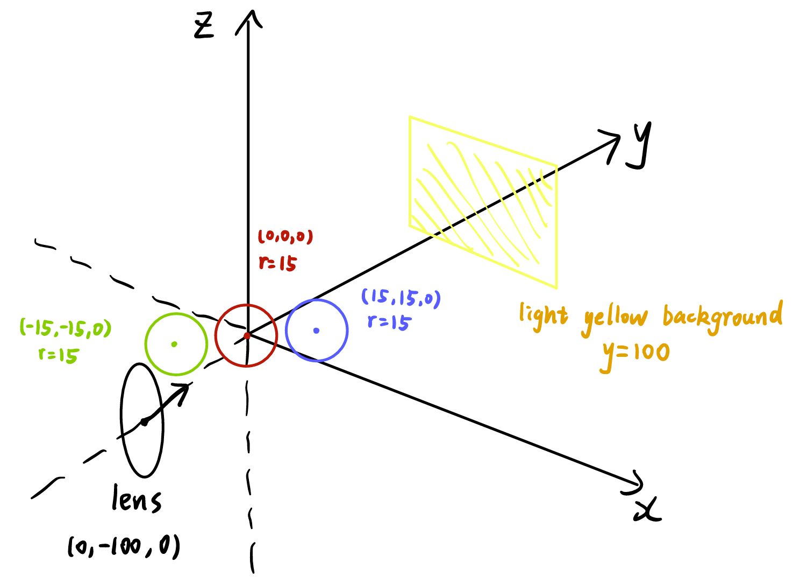
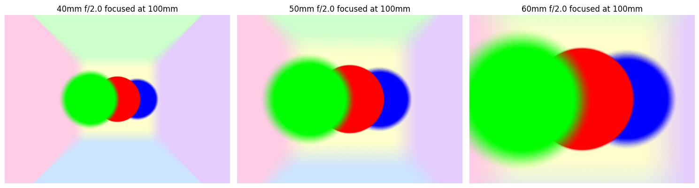
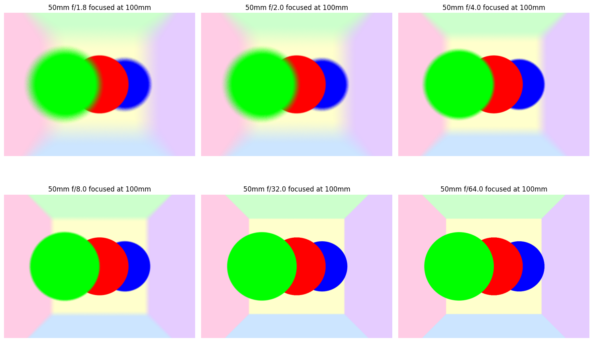
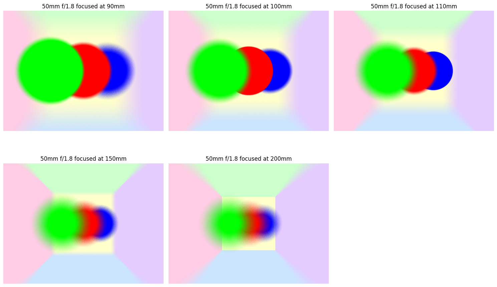
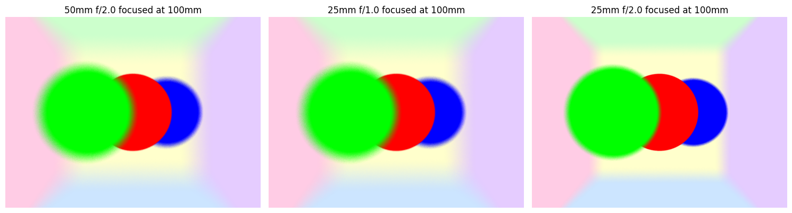

<!-- TOC -->
* [lens-simulator](#lens-simulator)
  * [Usage](#usage)
  * [Scene](#scene)
  * [Results](#results)
<!-- TOC -->

# lens-simulator

Simulate lens behavior through path tracing

## Usage

Set lens properties in `utils/Config.py` and run `main(filename)` from `main.py`.

The output image will be in the `img` folder.

## Scene

## Results

f/2 aperture focused at 100mm with variable focal length:

50mm lens focused at 100mm with variable aperture:

50mm f/1.8 with variable focal distance:

equivalent focal length (sensor size changes):

$$
f=\frac{1}{\frac{\ell'}{\ell}\cdot\frac{1}{f'} + \frac{1}{u}\left(1-\frac{\ell'}{\ell}\right)}
$$

